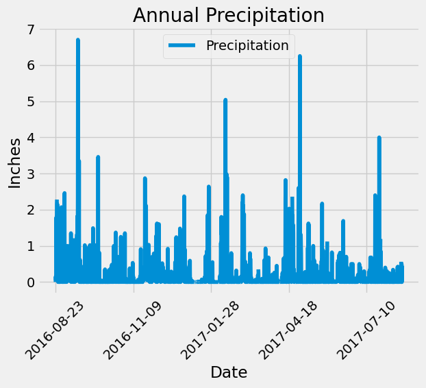
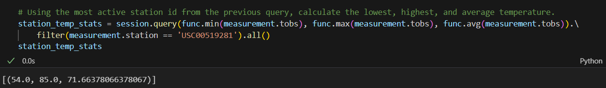
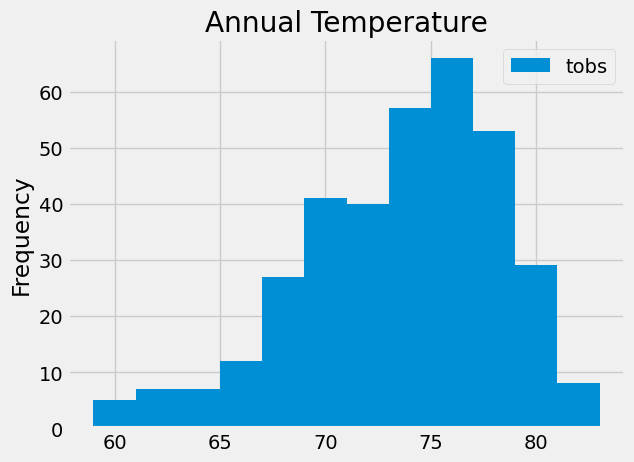
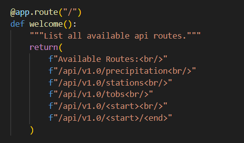
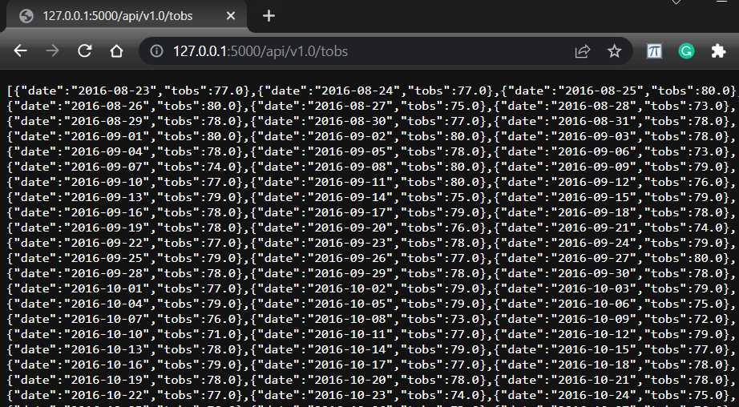
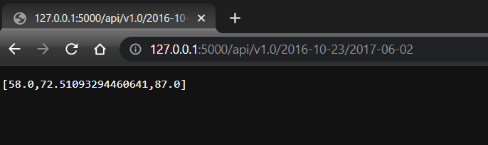

# sqlalchemy-challenge
Module 10 - SQLAlchemy

The purpose of this challenge is analyize weather patterns for Honolulu, Hawaii to determine the best time to visit for vacation. The take advantage of SQLAlchemy is fortunate that we have a .sqlite database file with all of the weather data we need to decide our preferred time to visit Honolulu.

The first step is to review the most recent year of data by sorting based on the most recent and moving backwards one year from that date. Once those dates are established we can use the automap_base to query the data from hawaii.sqlite and create a dataframe to plot the data. The dataframe is then used to plot precipitation data over the last year using matplotlib.

The next step is to determine the most active station in the dataset. This is done by grouping the data by station and counting the number of observations for each station. The station with the most observations is USC00519281 with 2772 observations. The next step is to determine the lowest, highest, and average temperature for this station. This is done by filtering the data for the station and using the min, max, and avg functions to determine the values. The results are as follows:

The final step of this analysis is to plot the temperature data for the most active station over the last year. This is done by filtering the data for the station and the last year of data. The data is then plotted using matplotlib to show the frequency of temperature observations.

With all of the data analyzed now it is time to create a Flask API to share the data vai the web. The first step is to create the routes for the API. The routes are as follows:

The next step is to create the functions for each route. The first route is the home page. This route will display the available routes for the API. The next route is the precipitation route. This route will query the database for the last year of precipitation data and return the results as a JSON object. The next route is the stations route. This route will query the database for the list of stations and return the results as a JSON object. The next route is the tobs route. This route will query the database for the last year of temperature data for the most active station and return the results as a JSON object. Below is an exceprt from that JSON object.

The last two routes are the start route and state/end route. The start route will query the database for the minimum, maximum, and average temperature for all dates greater than or equal to the 'start date' provided and return the results as a JSON object. The start/end route will query the database for the minimum, maximum, and average temperature for all dates between the start and end dates provided and return the results as a JSON object.

